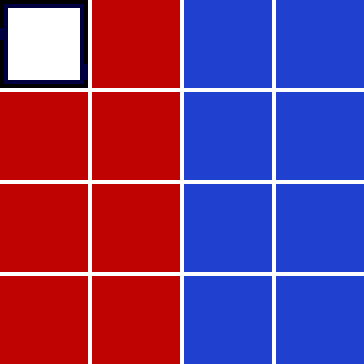
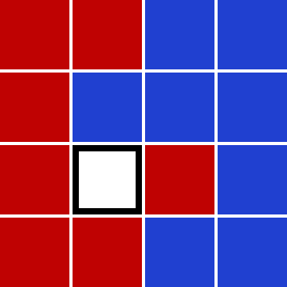

你大概听说过「十五数码游戏」（Fifteen Puzzle）。这里把带编号的滑块换成 7 块红色滑块和 8 块蓝色滑块。

一次 move 用**滑块滑动方向**（Left / Right / Up / Down）的英文首字母大写表示。例如从配置 ($S$) 出发，按序列 $LULUR$ 走完会到达配置 ($E$)：

（注意字母指的是**被推动的那块滑块滑动的方向**，也就是空位朝着相反方向移动一格。）

对每一条路径，按下面的伪代码计算它的 checksum：

$$
\begin{aligned}
\mathrm{checksum} &= 0\\
\mathrm{checksum} &= (\mathrm{checksum} \times 243 + m_1) \bmod 100\,000\,007\\
\mathrm{checksum} &= (\mathrm{checksum} \times 243 + m_2) \bmod 100\,000\,007\\
\cdots &\ \\
\mathrm{checksum} &= (\mathrm{checksum} \times 243 + m_n) \bmod 100\,000\,007
\end{aligned}
$$

其中 $m_k$ 是移动序列中第 $k$ 个字母的 ASCII 码，各方向对应的 ASCII 值为：

| L | R | U | D |
|---|---|---|---|
| $76$ | $82$ | $85$ | $68$ |

对上面给出的序列 $LULUR$，checksum 为 $19761398$。

现在，从配置 ($S$) 出发，找出所有能到达配置 ($T$) 的**最短**走法：

问所有最短路径的 checksum 之和是多少？
