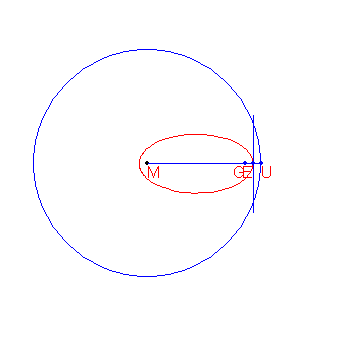
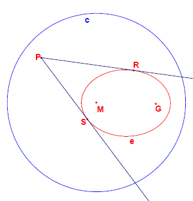

椭圆的一种定义方式是：

给定圆心为 $M$、半径为 $r$ 的圆 $c$，以及圆内一点 $G$（即 $d(G,M) \lt r$），则与圆 $c$ 和点 $G$ 等距的点的轨迹构成一个椭圆。

椭圆的作图方法如下图所示。

已知点 $M(-2000,1500)$ 与 $G(8000,1500)$，还已知圆心在 $M$、半径为 $15000$ 的圆 $c$。
与 $G$ 和圆 $c$ 等距的点的轨迹构成椭圆 $e$。

从椭圆 $e$ 外的一点 $P$ 向椭圆作两条切线 $t_1$ 与 $t_2$，设它们与椭圆的切点分别为 $R$ 和 $S$。

问：有多少个格点 $P$，使得角 $RPS$ 大于 $45$ 度？
