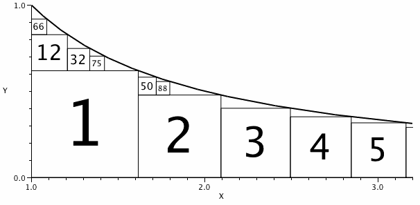

考虑由 $1 \le x$ 与 $0 \le y \le 1/x$ 所围成的区域。

设 $S_1$ 为能放进曲线下方的最大正方形。

设 $S_2$ 为剩余区域中能放下的最大正方形，依此类推。

定义 $S_n$ 的**索引**为二元组 $(\text{left}, \text{below})$，表示在 $S_n$ 左侧的正方形个数与在 $S_n$ 下方的正方形个数。

图中给出了一些这样的正方形，并标上了编号。

$S_2$ 的左侧有一个正方形、下方没有正方形，所以 $S_2$ 的索引是 $(1,0)$。

可以看出，$S_{32}$ 的索引是 $(1,1)$，$S_{50}$ 的索引也是 $(1,1)$。

$50$ 是索引为 $(1,1)$ 的 $S_n$ 中最大的 $n$。

索引为 $(3,3)$ 的 $S_n$ 中，最大的 $n$ 是多少？
