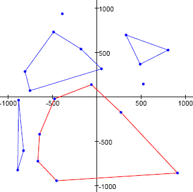

给定平面上一个点集，我们称**凸空穴**为：以点集中的某些点为顶点、且**内部**不含点集中任何给定点的凸多边形（除顶点以外，其他给定点允许落在多边形的边界上）。

例如，下图是一个含 20 个点的点集以及其中的若干凸空穴。图中红色七边形凸空穴的面积为 $1049694.5$ 平方单位，是该点集上面积最大的凸空穴。

本例使用前 20 个点 $(T_{2k-1}, T_{2k})$，其中 $k = 1, 2, \dots, 20$，由以下伪随机数生成器产生：

$$
\begin{aligned}
S_0 &= 290797 \\
S_{n+1} &= S_n^2 \bmod 50515093 \\
T_n &= (S_n \bmod 2000) - 1000
\end{aligned}
$$

即 $(527, 144)$、$(-488, 732)$、$(-454, -947)$、$\dots$

求由该伪随机序列前 $500$ 个点组成的点集中，凸空穴面积的最大值。

请给出答案，保留一位小数。
