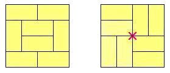

榻榻米是长方形的草席，用来完全盖住房间的地面，彼此不能重叠。

假设可用的榻榻米只有一种规格 $1 \times 2$，那么能被铺满的房间在形状和尺寸上显然会受到限制。

本题只考虑边长均为整数 $a, b$、面积为偶数 $s = a \cdot b$ 的长方形房间。我们用「面积」一词表示房间的地面面积，并且不失一般性加上条件 $a \le b$。

铺设榻榻米时须遵守一条规则：不能出现这样的点——四块不同榻榻米的角在该点相遇。

例如下面是同一个 $4 \times 4$ 房间的两种铺法：

左边的铺法可以接受，右边的则不行：图中央红色的「X」标出了四块榻榻米相遇的那一点。

由于这条规则，某些面积为偶数的房间无法被榻榻米铺满，我们称这样的房间为**无榻榻米铺法的房间**（tatami-free）。进一步地，定义 $T(s)$ 为面积为 $s$ 的无榻榻米铺法房间的个数。

最小的无榻榻米铺法房间面积是 $s = 70$，尺寸为 $7 \times 10$。面积为 $s = 70$ 的其余房间都能被榻榻米铺满，它们是 $1 \times 70$、$2 \times 35$、$5 \times 14$。因此 $T(70) = 1$。

类似地可以验证 $T(1320) = 5$，因为面积为 $s = 1320$ 的无榻榻米铺法房间恰好有 5 个：$20 \times 66$、$22 \times 60$、$24 \times 55$、$30 \times 44$、$33 \times 40$。事实上 $s = 1320$ 就是使 $T(s) = 5$ 的最小房间面积。

求使 $T(s) = 200$ 的最小房间面积 $s$。
