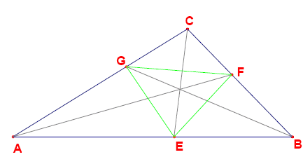

给定一个整边三角形 $ABC$，其三边满足 $a \le b \le c$，其中

$$
AB = c,\qquad BC = a,\qquad AC = b .
$$

三角形的三条角平分线分别与对边相交于点 $E$、$F$、$G$（见下图）。

线段 $EF$、$EG$、$FG$ 把三角形 $ABC$ 分成四个小三角形：$AEG$、$BFE$、$CGF$ 与 $EFG$。

可以证明，对这四小三角形中的每一个，面积比 $\operatorname{area}(ABC)/\operatorname{area}(\text{小三角形})$ 都是有理数。不过，也确实存在一些三角形，使其中某些或全部的这些面积比都是整数。

问：周长不超过 $100\,000\,000$ 的整边三角形 $ABC$ 中，有多少个满足「$\operatorname{area}(ABC)/\operatorname{area}(AEG)$ 为整数」？
