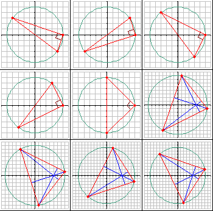

考虑所有满足以下条件的三角形：

- 三个顶点都是格点（坐标为整数）；
- 外心（外接圆的圆心）在原点 $O$；
- 垂心（三条高线的交点）在点 $H(5, 0)$。

周长 $\le 50$ 的这样的三角形共有九个。按周长从小到大列出如下：

- $A(-4, 3)$，$B(5, 0)$，$C(4, -3)$
- $A(4, 3)$，$B(5, 0)$，$C(-4, -3)$
- $A(-3, 4)$，$B(5, 0)$，$C(3, -4)$
- $A(3, 4)$，$B(5, 0)$，$C(-3, -4)$
- $A(0, 5)$，$B(5, 0)$，$C(0, -5)$
- $A(1, 8)$，$B(8, -1)$，$C(-4, -7)$
- $A(8, 1)$，$B(1, -8)$，$C(-4, 7)$
- $A(2, 9)$，$B(9, -2)$，$C(-6, -7)$
- $A(9, 2)$，$B(2, -9)$，$C(-6, 7)$

它们的周长之和四舍五入到四位小数是 $291.0089$。

求所有周长 $\le 10^5$ 的这样的三角形，并将它们的周长之和四舍五入到四位小数作为答案。
