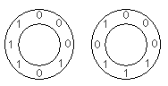

$2^N$ 个二进制位可以排成一个圆，使得所有 $N$ 位顺时针连续子序列都互不相同。

当 $N=3$ 时，忽略旋转一共有两种这样的圆排列：

对第一种排列，按顺时针方向读出的 $3$ 位子序列依次为
$000$、$001$、$010$、$101$、$011$、$111$、$110$、$100$。

每个圆排列都可以编码成一个数：以「全零子序列」作为最高位，沿顺时针方向依次拼接二进制位。
$N=3$ 的两个排列于是分别表示为 $23$ 与 $29$：

$$
\begin{aligned}
00010111_2 &= 23\\
00011101_2 &= 29
\end{aligned}
$$

记 $S(N)$ 为所有不同数值编码之和，则 $S(3) = 23 + 29 = 52$。

求 $S(5)$。
