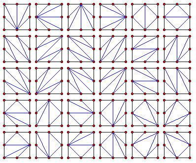

一个边长为整数 $N$ 的正方形纸片，一个顶点放在原点，两条边分别沿 $x$ 轴与 $y$ 轴。

我们按如下规则把它切开：

- 只允许沿直线段裁切，线段两端必须落在正方形的**不同边**上（即不存在一条边同时包含这两个端点；四个角点各自同时属于两条边），且端点坐标都是整数；
- 两条割线不能相交，但允许若干条割线交于边界上的同一个点；
- 一直切到不能再用合法割线为止。

把反射与旋转得到的方案都当作不同的方案，记 $C(N)$ 为 $N\times N$ 正方形的切法数。例如 $C(1)=2$、$C(2)=30$（见下图）。

求 $C(30)\bmod 10^8$。
