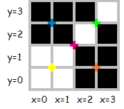

四叉树编码让我们能把一幅 $2^N \times 2^N$ 的黑白图像描述成一个比特序列（由 $0$ 和 $1$ 组成）。这些序列按如下方式从左到右阅读：

- 第一个比特针对整个 $2^N \times 2^N$ 区域；
- `0` 表示一次**分裂**：当前的 $2^n \times 2^n$ 区域被分成 $4$ 个 $2^{n-1} \times 2^{n-1}$ 的子区域，随后的比特按「左上、右上、左下、右下」的次序依次描述这 4 个子区域；
- `10` 表示当前区域只含黑色像素；
- `11` 表示当前区域只含白色像素。

考虑下面这幅 $4 \times 4$ 图像（彩色标记表示可以发生分裂的位置）：

这幅图像可以用若干条序列描述，例如长度为 $30$ 的 `001010101001011111011010101010`，或长度为 $16$ 的 `0100101111101110`——后者是该图像的最小序列。

对正整数 $N$，定义 $D_N$ 为满足如下着色规则的 $2^N \times 2^N$ 图像：坐标 $x = 0, y = 0$ 的像素是**左下角**的像素；若

$$
(x-2^{N-1})^2+(y-2^{N-1})^2 \le 2^{2N-2}
$$

则像素为黑色，否则为白色。描述 $D_{24}$ 的最小序列长度是多少？
