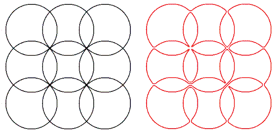

设 $C(x,y)$ 是过 $(x,y)$、$(x,y+1)$、$(x+1,y)$、$(x+1,y+1)$ 四点的圆。

对正整数 $m$、$n$，记 $E(m,n)$ 为由 $m\cdot n$ 个这样的圆组成的构型：

$$
E(m,n)=\{\,C(x,y):0\le x<m,\ 0\le y<n,\ x,y\in\mathbb Z\,\}.
$$

每个圆都被它经过的那四个格点分成 $4$ 条弧，每条弧连接一对相邻格点，因此 $E(m,n)$ 上共有 $4mn$ 条弧。$E(m,n)$ 上的**欧拉回路**是一条把每条弧恰好走一次的闭合路径。这样的路径有很多种，但我们只关心其中**不自交叉**的那些：不自交叉的路径可以在格点处与自身相切，但永远不会穿过自身。

下图是 $E(3,3)$，以及一条不自交叉欧拉回路的示例。

记 $L(m,n)$ 为 $E(m,n)$ 上不自交叉欧拉回路的条数。例如 $L(1,2)=2$、$L(2,2)=37$、$L(3,3)=104290$。求 $L(6,10)\bmod 10^{10}$。
