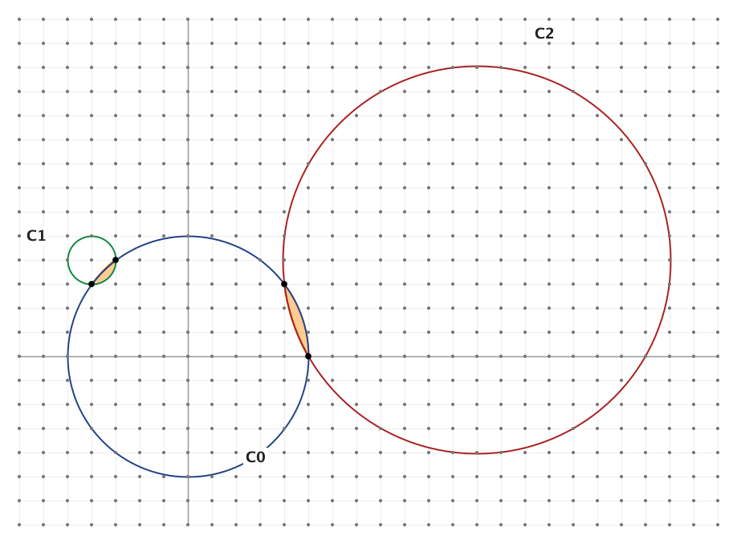

我们把两个圆所围成的凸区域称为一个**双凸透镜孔**（lenticular hole），如果它满足：

- 两个圆的圆心都落在格点（整点）上；
- 两个圆交于两个**不同**的格点；
- 这个凸区域的**内部**不含任何格点。

考虑下面三个圆：

$$
C_0:\ x^2 + y^2 = 25, \qquad C_1:\ (x+4)^2 + (y-4)^2 = 1, \qquad C_2:\ (x-12)^2 + (y-4)^2 = 65
$$

图中 $C_0$ 与 $C_1$ 围成一个双凸透镜孔，$C_0$ 与 $C_2$ 也围成一个。

如果存在半径分别为 $r_1$ 和 $r_2$ 的两个圆能围出一个双凸透镜孔，就称有序正实数对 $(r_1, r_2)$ 为一个**透镜对**。

可以验证，上例对应的透镜对是 $(1, 5)$ 与 $(5, \sqrt{65})$。

记 $L(N)$ 为满足 $0 < r_1 \le r_2 \le N$ 的**不同**透镜对 $(r_1, r_2)$ 的个数。已知 $L(10) = 30$、$L(100) = 3442$。

求 $L(100\,000)$。
