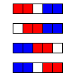

# 306 · 纸带游戏

> 中文意译。英文原文见 [Project Euler Problem 306](https://projecteuler.net/problem=306)；抓取底稿见 `statement.en.md`。

下面这个游戏是组合博弈论里的经典例子：

由 $n$ 个白色方格排成一条纸带，两名玩家轮流行动。每回合，玩家挑两个**相邻**的白格涂黑。无法行动的玩家输。

- $n=1$：没有合法走法，先手直接输；
- $n=2$：只有一种走法，走完后后手无路可走，后手输；
- $n=3$：有两种走法，但无论怎么走，后手都输；
- $n=4$：先手有三种走法，涂黑中间两格即可获胜；
- $n=5$：先手有四种走法（下图标红），但无论怎么走，后手（蓝方）获胜。

因此对 $1 \le n \le 5$，先手必胜的 $n$ 有 3 个。类似地，对 $1 \le n \le 50$，先手必胜的 $n$ 有 40 个。

对 $1 \le n \le 1\,000\,000$，先手必胜的 $n$ 有多少个？
