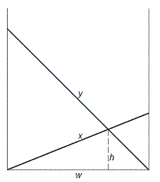

# 309 · 整数梯子

> 中文意译。英文原文见 [Project Euler Problem 309](https://projecteuler.net/problem=309)；抓取底稿见 `statement.en.md`。

经典的「交叉梯子」问题：一条窄而平直的小巷两侧各靠着一架梯子，长度分别为 $x$、$y$；两梯交叉点距地面的高度为 $h$，求巷宽 $w$。

这里只关心四个变量都是正整数的情形。例如 $x=70$、$y=119$、$h=30$ 时，可算出 $w=56$。

事实上，当 $x,y,h$ 都是整数且 $0<x<y<200$ 时，只有五组 $(x,y,h)$ 使 $w$ 为整数：$(70,119,30)$、$(74,182,21)$、$(87,105,35)$、$(100,116,35)$、$(119,175,40)$。

当 $x,y,h$ 都是整数且 $0<x<y<1\,000\,000$ 时，有多少组 $(x,y,h)$ 使 $w$ 为整数？
