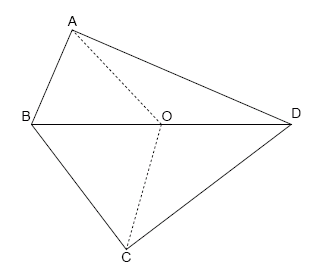

# 311 · 双斜整数四边形

> 中文意译。英文原文见 [Project Euler Problem 311](https://projecteuler.net/problem=311)；抓取底稿见 `statement.en.md`。

$ABCD$ 是凸的整边四边形，边长满足 $1 \le AB < BC < CD < AD$；对角线 $BD$ 长为整数；$O$ 是 $BD$ 的中点，且 $AO$ 长为整数。若 $AO = CO \le BO = DO$，则称 $ABCD$ 为**双斜整数四边形**。

例如下面的四边形就是双斜整数四边形：$AB=19$、$BC=29$、$CD=37$、$AD=43$、$BD=48$，且 $AO=CO=23$。

记 $B(N)$ 为满足 $AB^2+BC^2+CD^2+AD^2 \le N$ 的互不相同的双斜整数四边形 $ABCD$ 的个数。可以验证 $B(10\,000)=49$，$B(1\,000\,000)=38239$。

求 $B(10\,000\,000\,000)$。
