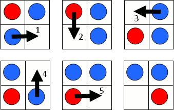
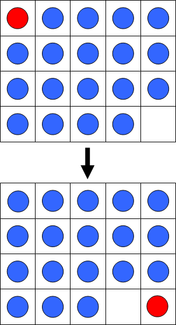

# 313 · 滑块游戏

> 中文意译。英文原文见 [Project Euler Problem 313](https://projecteuler.net/problem=313)；抓取底稿见 `statement.en.md`。

在这个滑块游戏里，棋子可以水平或竖直滑入空格。目标是把红色棋子从网格左上角移到右下角；空格一开始位于右下角。例如下图展示了 $2 \times 2$ 网格上五步完成游戏的过程。

记 $S(m,n)$ 为在 $m \times n$ 网格上完成游戏所需的最小步数。例如可以验证 $S(5,4)=25$。

有恰好 $5482$ 个网格满足 $S(m,n)=p^2$，其中 $p<100$ 为素数。

有多少个网格满足 $S(m,n)=p^2$，其中 $p<10^6$ 为素数？
