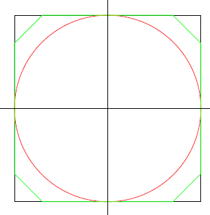

# 314 · 月球上的老鼠

> 中文意译。英文原文见 [Project Euler Problem 314](https://projecteuler.net/problem=314)；抓取底稿见 `statement.en.md`。

月球被开放出来，土地可以免费获得——但有个条件：你得在自己圈出的土地周围建一圈墙，而在月球上建墙很贵。每个国家分到一块 $500\ \text{m} \times 500\ \text{m}$ 的正方形区域，但只有被墙围起来的部分才归其所有。区域内有 $251001$ 根柱子，按 $1$ 米间距排成方格网；墙必须是由一根根柱子之间连成的直线段组成的闭合折线。

大国当然建了一圈 $2000\ \text{m}$ 的墙，把整个 $250\,000\ \text{m}^2$ 区域围了起来。[大芬威克公国](http://en.wikipedia.org/wiki/Grand_Fenwick)预算紧张，请身为皇家程序员的你算一算：什么形状能让「围出面积 / 墙长」最大？

你在纸上做了些初步计算。用 $2000$ 米的墙围住 $250\,000\ \text{m}^2$ 区域，面积-墙长比为 $125$。虽然不允许，但为了有个参照：如果在正方形内放一个与四边相切的圆，面积为 $\pi \times 250^2\ \text{m}^2$、周长为 $\pi \times 500\ \text{m}$，面积-墙长比同样是 $125$。

而如果从正方形四角各切掉一个边长为 $75\ \text{m}$、$75\ \text{m}$、$75\sqrt 2\ \text{m}$ 的三角形，总面积变为 $238750\ \text{m}^2$，周长变为 $1400 + 300\sqrt 2\ \text{m}$，面积-墙长比为 $130.87$，明显更优。

求面积-墙长比的最大值。结果四舍五入到小数点后 $8$ 位，写成 abc.defghijk 的形式。
