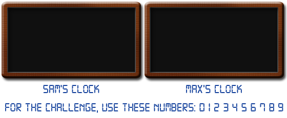

# 315 · 数根时钟

> 中文意译。英文原文见 [Project Euler Problem 315](https://projecteuler.net/problem=315)；抓取底稿见 `statement.en.md`。

Sam 和 Max 要把两个数字钟改造成两个「数根时钟」。数根时钟会一步步地计算数根：喂给它一个数，它先显示这个数，然后开始计算，依次显示所有中间值，直到得到结果。例如喂给它 137，它会依次显示「137」→「11」→「2」，随后熄灭，等待下一个数。

每个数字由若干段笔画组成：三段横向（上、中、下）与四段纵向（左上、右上、左下、右下）。数字「1」由右上、右下两段纵向笔画组成；「4」由中横加上左上、右上、右下三段纵向笔画组成；「8」点亮全部笔画。

时钟只在笔画点亮/熄灭时耗能。点亮一个「2」要 5 次切换，而「7」只要 4 次。

两人造出的时钟不同。

以 137 为例，Sam 的时钟流程是：显示「137」→ 整块面板熄灭 → 点亮「11」→ 面板再次熄灭 → 点亮「2」→ 过一会儿熄灭。所需切换次数为：

- 「137」：$(2+5+4)\times 2 = 22$（点亮+熄灭）；
- 「11」：$(2+2)\times 2 = 8$；
- 「2」：$5\times 2 = 10$；

合计 40 次。

Max 的时钟不同：它只熄灭下一个数不需要的笔画。以 137 为例：

- 「137」：$2+5+4=11$ 次点亮；再用 7 次熄灭「11」用不到的笔画；
- 「11」：0 次（「11」已经正确点亮）；再用 3 次熄灭第一个「1」以及第二个「1」的下半部分（上半部分与数字「2」共用）；
- 「2」：4 次点亮剩余笔画凑出「2」；再用 5 次熄灭「2」；

合计 30 次。

显然 Max 的时钟更省电。现在把 $10^7$ 到 $2\times 10^7$ 之间的所有素数依次喂给两个时钟。求 Sam 的时钟与 Max 的时钟所需总切换次数之差。
