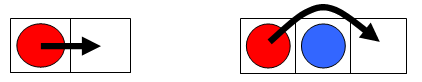

# 321 · 交换棋子

> 中文意译。英文原文见 [Project Euler Problem 321](https://projecteuler.net/problem=321)；抓取底稿见 `statement.en.md`。

一行 $2n+1$ 个方格，一端放 $n$ 枚红色棋子、另一端放 $n$ 枚蓝色棋子，正中间隔着一个空格。例如 $n=3$ 时：

棋子可以滑到相邻空格（slide），也可以跳过相邻的一枚棋子（hop），只要落点为空。

记 $M(n)$ 为把红蓝棋子的位置完全对调（所有红子到右边、所有蓝子到左边）所需的最少步数/操作数。

可以验证 $M(3)=15$，恰好是一个三角形数。

把使 $M(n)$ 为三角形数的 $n$ 依次排成数列，前五项是 $1$、$3$、$10$、$22$、$63$，它们的和为 $99$。

求该数列前四十项的和。
