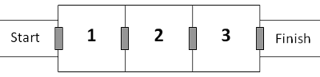

# 327 · 厄运之室

> 中文意译。英文原文见 [Project Euler Problem 327](https://projecteuler.net/problem=327)；抓取底稿见 `statement.en.md`。

一连串三个房间由自动门依次连通。

每道门都要刷一张安全卡才能打开。一旦进入房间，门会自动关闭，那张安全卡就报废了。起点的发卡机会无限制地提供安全卡；但每个房间（包括起始房间）都有扫描仪：一旦检测到你身上带了超过三张卡、或者地上有无人照看的安全卡，所有的门都会永久锁死。不过，每个房间里都有一个箱子，可以安全存放任意数量的卡，供以后取用。

如果你单纯每次带三张卡往前冲，走进 3 号房时三张卡就全用光了，会永远困在里面！

但利用储物箱就能逃出。例如：刷第 1 张卡进入 1 号房，把第 2 张卡存进箱子，刷第 3 张卡原路返回起点；从发卡机再领 3 张卡，刷 1 张进入 1 号房，取出刚才存的卡——此时手上又有 3 张卡，足够刷过剩下的门。这个方案总共用 6 张安全卡穿过了全部 3 个房间。

身上最多带 3 张卡时，穿过 6 个房间总共需要 123 张卡。

设 $C$ 为任何时刻身上最多允许携带的卡数，$R$ 为需要穿过的房间数。记 $M(C, R)$ 为身上最多带 $C$ 张卡时、穿过 $R$ 个房间所需从发卡机领取的最小卡数。

已知 $M(3,6)=123$，$M(4,6)=23$；对 $3 \le C \le 4$，有 $\sum M(C,6)=146$。

又已知对 $3 \le C \le 10$，有 $\sum M(C,10)=10382$。

求 $\displaystyle\sum_{C=3}^{40} M(C,30)$。
