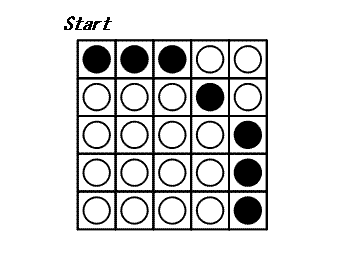

# 331 · 十字翻转

> 中文意译。英文原文见 [Project Euler Problem 331](https://projecteuler.net/problem=331)；抓取底稿见 `statement.en.md`。

正方形棋盘上摆放着 $N \times N$ 枚棋子，每枚棋子一面黑一面白。

每回合你可以任选一枚棋子，把它所在整行与整列的所有棋子同时翻转：每次翻转 $2N - 1$ 枚。所有棋子都翻到白面时游戏结束。下图展示了 $5 \times 5$ 棋盘上的一个例子，可以证明最少需要 3 回合完成。

$N \times N$ 棋盘左下角坐标为 $(0,0)$，右下角为 $(N-1,0)$，左上角为 $(0,N-1)$。

定义 $N \times N$ 棋盘的初始局面 $C_N$ 如下：满足 $N - 1 \le \sqrt{x^2 + y^2} < N$ 的棋子 $(x,y)$ 初始为黑面朝上，其余均为白面朝上（上图即为 $C_5$）。

记 $T(N)$ 为从局面 $C_N$ 出发完成游戏所需的最小回合数；若无解则 $T(N)=0$。

已知 $T(5)=3$，$T(10)=29$，$T(1000)=395253$。

求 $\displaystyle\sum_{i=3}^{31} T(2^i - i)$。
