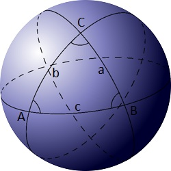

# 332 · 球面三角形

> 中文意译。英文原文见 [Project Euler Problem 332](https://projecteuler.net/problem=332)；抓取底稿见 `statement.en.md`。

球面三角形是由球面上三个大圆圆弧两两相交形成的图形。

设 $C(r)$ 是以 $(0,0,0)$ 为中心、半径为 $r$ 的球面。记 $Z(r)$ 为 $C(r)$ 球面上坐标全为整数的点集。

记 $T(r)$ 为以 $Z(r)$ 中点为顶点的非退化球面三角形集合（三点共大圆的退化三角形不计入）。

记 $A(r)$ 为 $T(r)$ 中面积最小的球面三角形的面积。例如 $A(14) \approx 3.294040$（四舍五入到六位小数）。

求 $\displaystyle\sum_{r=1}^{50} A(r)$，结果四舍五入到六位小数。
