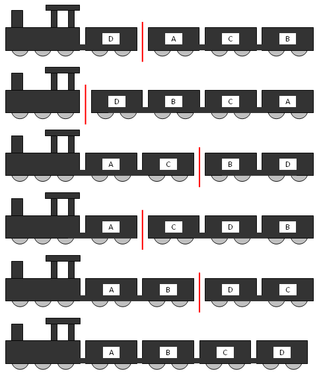

# 336 · 最费转盘

> 中文意译。英文原文见 [Project Euler Problem 336](https://projecteuler.net/problem=336)；抓取底稿见 `statement.en.md`。

一列火车按 ABCD 的顺序运送四节车厢。但有时开车来挂钩时，车厢顺序并不正确。

为重新排列车厢，它们被全部推上一台大型旋转转盘。在某一点解钩后，火车带着仍相连的车厢驶离转盘；剩下的车厢被旋转 180 度；随后所有车厢重新连挂，如此反复，以期用最少的转盘次数完成排序。

有些排列很容易解决，比如 ADCB：在 A 与 D 之间分开，旋转 DCB 后就得到了正确顺序。

然而，火车司机 Simple Simon 以效率不高著称，他总是依次把 A、B、…… 各节车厢摆到正确位置。

对四节车厢而言，Simon 遇到的最坏排列（称为 maximix 排列）是 DACB 与 DBAC，每种都要他转五次（用最高效的方法其实只要三次）。DACB 的处理过程如下：

可以验证六节车厢共有 24 个 maximix 排列，其中字典序第 10 个是 DFAECB。

求十一节车厢的第 2011 个字典序 maximix 排列。
