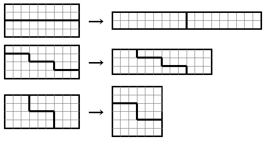

# 338 · 剪裁方格纸

> 中文意译。英文原文见 [Project Euler Problem 338](https://projecteuler.net/problem=338)；抓取底稿见 `statement.en.md`。

给定一张 $w \times h$ 的长方形方格纸，格距为 $1$。

沿格线把纸剪成两片，再不重叠地重排这两片，就能拼出尺寸不同的新长方形。

例如 $9 \times 4$ 的纸可以拼出 $18 \times 2$、$12 \times 3$ 和 $6 \times 6$ 的长方形：

类似地，$9 \times 8$ 的纸可以拼出 $18 \times 4$ 与 $12 \times 6$。

对一对 $w, h$，记 $F(w, h)$ 为用 $w \times h$ 的纸能拼出的互不相同的长方形个数。例如 $F(2,1)=0$，$F(2,2)=1$，$F(9,4)=3$，$F(9,8)=2$。

注意：与原纸全等的长方形不计入 $F(w,h)$；$w \times h$ 与 $h \times w$ 视为同一种，不重复计数。

对整数 $N$，记 $G(N)$ 为所有满足 $0 < h \le w \le N$ 的 $(w,h)$ 的 $F(w,h)$ 之和。

可以验证 $G(10)=55$，$G(10^3)=971745$，$G(10^5)=9992617687$。

求 $G(10^{12}) \bmod 10^8$。
