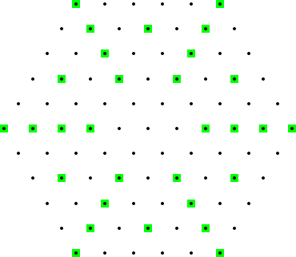

# 351 · 六边形果园

> 中文意译。英文原文见 [Project Euler Problem 351](https://projecteuler.net/problem=351)；抓取底稿见 `statement.en.md`。

$n$ 阶**六边形果园**是由边长为 $n$ 的正六边形内所有格点构成的三角点阵。下面是 $n=5$ 的六边形果园示例：

图中以绿色标出的点，是被更靠近中心的点挡住视线的点。可见 $n=5$ 的六边形果园中有 $30$ 个点被中心遮挡。

记 $H(n)$ 为 $n$ 阶六边形果园中被中心遮挡的点数。

已知 $H(5)=30$，$H(10)=138$，$H(1000)=1177848$。

求 $H(100\,000\,000)$。
