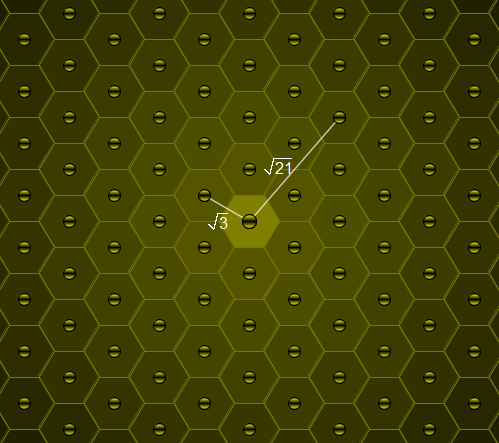

# 354 · 蜂巢中的距离

> 中文意译。英文原文见 [Project Euler Problem 354](https://projecteuler.net/problem=354)；抓取底稿见 `statement.en.md`。

考虑蜜蜂的蜂巢，其中每个巢房都是边长为 $1$ 的正六边形。

其中一个巢房住着蜂王。

对正实数 $L$，记 $\text{B}(L)$ 为与蜂王所在巢房距离为 $L$ 的巢房数（距离都按中心到中心度量；可以认为蜂巢足够大，能容纳任何需要考虑的距离）。

例如 $\text{B}(\sqrt 3)=6$，$\text{B}(\sqrt {21})=12$，$\text{B}(111\,111\,111)=54$。

求满足 $\text{B}(L)=450$ 且 $L \le 5\times 10^{11}$ 的 $L$ 的个数。
