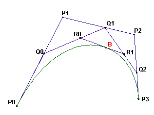

# 363 · 贝塞尔曲线

> 中文意译。英文原文见 [Project Euler Problem 363](https://projecteuler.net/problem=363)；抓取底稿见 `statement.en.md`。

三次贝塞尔曲线由四个点 $P_0, P_1, P_2, P_3$ 定义。

曲线的构造方式如下：

- 在 $P_0P_1$、$P_1P_2$、$P_2P_3$ 三条线段上分别取点 $Q_0, Q_1, Q_2$，使得 $\dfrac{P_0Q_0}{P_0P_1} = \dfrac{P_1Q_1}{P_1P_2} = \dfrac{P_2Q_2}{P_2P_3} = t$，其中 $t \in [0,1]$；
- 在 $Q_0Q_1$ 与 $Q_1Q_2$ 上分别取点 $R_0$ 与 $R_1$，使得 $\dfrac{Q_0R_0}{Q_0Q_1} = \dfrac{Q_1R_1}{Q_1Q_2} = t$，$t$ 取同一个值；
- 在 $R_0R_1$ 上取点 $B$，使得 $\dfrac{R_0B}{R_0R_1} = t$，$t$ 仍取同一个值。

由 $P_0,P_1,P_2,P_3$ 定义的贝塞尔曲线，就是当 $Q_0$ 取遍 $P_0P_1$ 上所有可能位置时 $B$ 的轨迹。（注意所有点用的都是同一个 $t$ 值。）

由构造过程可见，贝塞尔曲线在 $P_0$ 处与线段 $P_0P_1$ 相切，在 $P_3$ 处与线段 $P_2P_3$ 相切。

现在用 $P_0=(1,0)$、$P_1=(1,v)$、$P_2=(v,1)$、$P_3=(0,1)$ 的三次贝塞尔曲线来逼近四分之一圆。

$v>0$ 的取值使得：直线 $OP_0$、$OP_3$ 与曲线围成的面积恰好等于 $\dfrac{\pi}{4}$（即四分之一圆的面积）。

曲线长度与四分之一圆周长相差百分之多少？

也就是说，若 $L$ 为曲线长度，计算 $100\times\dfrac{L-\frac{\pi}{2}}{\frac{\pi}{2}}$，结果四舍五入到小数点后 $10$ 位。
