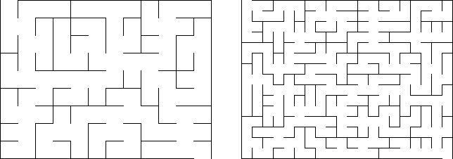

# 380 · 迷宫计数

> 中文意译。英文原文见 [Project Euler Problem 380](https://projecteuler.net/problem=380)；抓取底稿见 `statement.en.md`。

一个 $m \times n$ 的矩形迷宫是指：在格点之间放置墙壁，使得从左上角格子到任意其他格子都**恰有一条**路径。下面是 $9 \times 12$ 与 $15 \times 20$ 迷宫的示例：

记 $C(m,n)$ 为互不相同的 $m \times n$ 迷宫的个数。旋转或镜像得到的迷宫视为不同。

可以验证 $C(1,1)=1$，$C(2,2)=4$，$C(3,4)=2415$；而 $C(9,12) \approx 2.5720\times 10^{46}$（科学计数法保留 5 位有效数字）。

求 $C(100,500)$，用科学计数法表示并保留 5 位有效数字。

输入格式说明：用小写字母 e 分隔尾数与指数，例如 $1234567891011$ 写成 `1.2346e12`。
