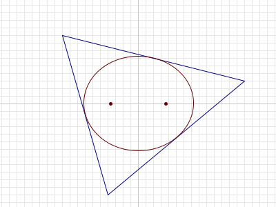

# 385 · 三角形内的椭圆

> 中文意译。英文原文见 [Project Euler Problem 385](https://projecteuler.net/problem=385)；抓取底稿见 `statement.en.md`。

可以证明，对平面上的任意三角形 $T$，都存在唯一一个**完全包含在 $T$ 内、面积最大**的椭圆。

对给定的 $n$，考虑满足以下条件的三角形 $T$：

- $T$ 的三个顶点坐标都是整数，绝对值不超过 $n$；
- $T$ 内最大面积椭圆的**两个焦点**为 $(\sqrt{13}, 0)$ 与 $(-\sqrt{13}, 0)$。

记 $A(n)$ 为所有这类三角形的面积之和。

例如 $n=8$ 时这样的三角形有两个，顶点分别为 $(-4,-3), (-4,3), (8,0)$ 与 $(4,3), (4,-3), (-8,0)$，每个面积都是 $36$，故 $A(8)=36+36=72$。

可以验证 $A(10)=252$，$A(100)=34632$，$A(1000)=3529008$。

求 $A(1\\,000\\,000\\,000)$。

（注：椭圆的「焦点」指椭圆内部的一对点 $A$ 与 $B$，使得椭圆上任意一点 $P$ 都满足 $AP+PB$ 为定值。）
