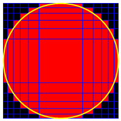

# 392 · 缠绕的单位圆

> 中文意译。英文原文见 [Project Euler Problem 392](https://projecteuler.net/problem=392)；抓取底稿见 `statement.en.md`。

**直角网格**（rectilinear grid）是一种正交网格，网格线之间的间距不必相等（对数坐标纸就是例子）。

在笛卡尔坐标系中考虑满足以下性质的直角网格：

- 网格线平行于坐标轴；
- 共有 $N+2$ 条竖直网格线与 $N+2$ 条水平网格线，因而共有 $(N+1)\\times(N+1)$ 个矩形单元；
- 最外侧两条竖直网格线的方程为 $x=-1$ 与 $x=1$；
- 最外侧两条水平网格线的方程为 $y=-1$ 与 $y=1$；
- 与单位圆有重叠的网格单元染成红色，其余染成黑色。

本题要求确定其余 $N$ 条内部水平线与 $N$ 条内部竖直线的位置，使红色单元所占面积最小。

例如 $N=10$ 时的解如下图：

$N=10$ 时红色单元所占面积（四舍五入到小数点后 10 位）为 $3.3469640797$。

求 $N=400$ 时该面积的值。
