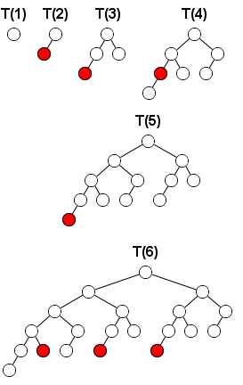

# 400 · 斐波那契树游戏

> 中文意译。英文原文见 [Project Euler Problem 400](https://projecteuler.net/problem=400)；抓取底稿见 `statement.en.md`。

**斐波那契树**是一种递归定义的二叉树：

- $T(0)$ 为空树；
- $T(1)$ 为仅含一个节点的二叉树；
- $T(k)$ 由一个根节点组成，其左右子树分别为 $T(k-1)$ 与 $T(k-2)$。

两人在这样的树上玩拿取游戏。每回合玩家选取一个节点，将该节点以及以它为根的整棵子树全部移除。

被迫拿走**整棵树的根节点**的玩家落败。

下图给出了在 $T(k)$（$k=1$ 到 $6$）上先手在第一回合的所有必胜走法（以绿色标出的节点）：

记 $f(k)$ 为在 $T(k)$ 上进行该游戏时，先手在第一回合的必胜走法数（即使得后手没有任何必胜策略的走法数）。

例如 $f(5)=1$，$f(10)=17$。

求 $f(10000)$ 的最后 $18$ 位。
