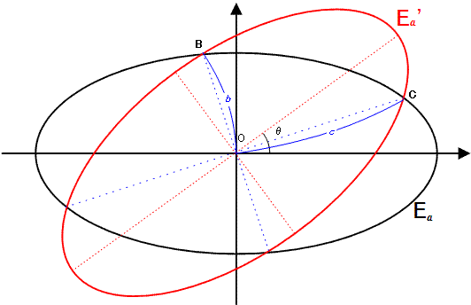

# 404 · 交叉的椭圆

> 中文意译。英文原文见 [Project Euler Problem 404](https://projecteuler.net/problem=404)；抓取底稿见 `statement.en.md`。

$E_a$ 是方程为 $x^2 + 4y^2 = 4a^2$ 的椭圆。
$E_a^\prime$ 是把 $E_a$ 绕原点 $O(0, 0)$ 逆时针旋转 $\theta$ 度所得的图像，其中 $0^\circ \lt \theta \lt 90^\circ$。

$b$ 是两个离原点最近的交点到原点的距离，$c$ 是另外两个交点到原点的距离。
若 $a$、$b$、$c$ 都是正整数，则称有序三元组 $(a, b, c)$ 为规范椭圆三元组。
例如 $(209, 247, 286)$ 就是一个规范椭圆三元组。

记 $C(N)$ 为 $a \leq N$ 的不同规范椭圆三元组 $(a, b, c)$ 的个数。
可以验证 $C(10^3) = 7$，$C(10^4) = 106$，$C(10^6) = 11845$。

求 $C(10^{17})$。
