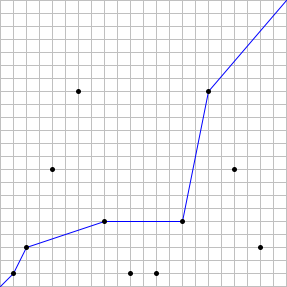

# 411 · 上坡路径

> 中文意译。英文原文见 [Project Euler Problem 411](https://projecteuler.net/problem=411)；抓取底稿见 `statement.en.md`。

设 $n$ 为正整数。假设在坐标 $(x, y) = (2^i \bmod n, 3^i \bmod n)$ 处设有车站，其中 $0 \leq i \leq 2n$。坐标相同的车站视为同一座车站。

我们希望构造一条从 $(0, 0)$ 到 $(n, n)$ 的路径，使得 $x$ 坐标与 $y$ 坐标都不减。
记 $S(n)$ 为这样的路径最多能经过的车站数。

例如，当 $n = 22$ 时共有 $11$ 座不同的车站，而一条合法路径最多能经过 $5$ 座车站。因此 $S(22) = 5$。下图给出了一个最优路径的例子：

还可以验证 $S(123) = 14$，$S(10000) = 48$。

求 $1 \leq k \leq 30$ 时 $\sum S(k^5)$。
