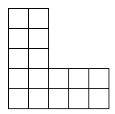
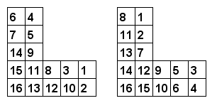

# 412 · 缺角方阵的编号

> 中文意译。英文原文见 [Project Euler Problem 412](https://projecteuler.net/problem=412)；抓取底稿见 `statement.en.md`。

对整数 $m, n$（$0 \leq n \lt m$），记 $L(m, n)$ 为从 $m \times m$ 方格中去掉右上角 $n \times n$ 方格后剩下的图形。

例如，$L(5, 3)$ 如下：

我们想用连续整数 $1, 2, 3, \dots$ 给 $L(m, n)$ 的每个格子编号，使得每个格子里的数都小于它下方和左方格子里的数。

例如，下面是 $L(5, 3)$ 的两种合法编号方式：

记 $\operatorname{LC}(m, n)$ 为 $L(m, n)$ 的合法编号方式数。
可以验证 $\operatorname{LC}(3, 0) = 42$，$\operatorname{LC}(5, 3) = 250250$，$\operatorname{LC}(6, 3) = 406029023400$，$\operatorname{LC}(10, 5) \bmod 76543217 = 61251715$。

求 $\operatorname{LC}(10000, 5000) \bmod 76543217$。
