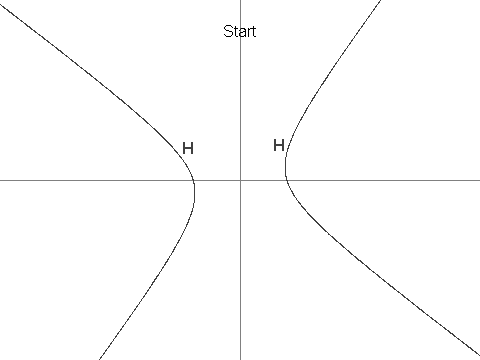

# 422 · 双曲线上的点列

> 中文意译。英文原文见 [Project Euler Problem 422](https://projecteuler.net/problem=422)；抓取底稿见 `statement.en.md`。

设 $H$ 为方程 $12x^2 + 7xy - 12y^2 = 625$ 所定义的双曲线。

再设 $X$ 为点 $(7,1)$，可以看出 $X$ 在 $H$ 上。

现在在 $H$ 上定义点列 $\{P_i: i \geq 1\}$：

$P_1 = (13, 61/4)$，$P_2 = (-43/6, -4)$；

对 $i \gt 2$，$P_i$ 是 $H$ 上与 $P_{i-1}$ 不同的那个唯一点，且直线 $P_iP_{i-1}$ 平行于直线 $P_{i-2}X$。可以证明 $P_i$ 是良定义的，且其坐标总是有理数。

已知 $P_3 = (-19/2, -229/24)$，$P_4 = (1267/144, -37/12)$，以及 $P_7 = (17194218091/143327232, 274748766781/1719926784)$。

求 $P_n$，其中 $n = 11^{14}$，答案按如下格式给出：若 $P_n = (a/b, c/d)$，其中分数为既约分数且分母为正，则答案为 $(a + b + c + d) \bmod 1\,000\,000\,007$。

例如 $n = 7$ 时，答案会是 806236837。
