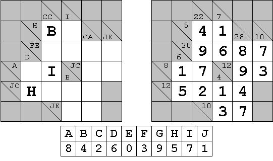

# 424 · Kakuro 数字谜题

> 中文意译。英文原文见 [Project Euler Problem 424](https://projecteuler.net/problem=424)；抓取底稿见 `statement.en.md`。

上图是一道 kakuro（又称 cross sums、sums cross）谜题的示例，右侧是它的最终解答。（kakuro 谜题的常见规则很容易在网上各大站点查到；其他相关信息目前也可在 [krazydad.com](http://krazydad.com/) 找到，本站作者为本题提供了谜题数据。）

可下载的文本文件（[kakuro200.txt](https://projecteuler.net/resources/documents/0424_kakuro200.txt)）中描述了 200 道这样的谜题，混合了 5×5 与 6×6 两种类型。文件中的第一道谜题即上图示例，其编码如下：

`6,X,X,(vCC),(vI),X,X,X,(hH),B,O,(vCA),(vJE),X,(hFE,vD),O,O,O,O,(hA),O,I,(hJC,vB),O,O,(hJC),H,O,O,O,X,X,X,(hJE),O,O,X`

第一个字符是一个数字，表示信息网格的大小：为 6（对应 5×5 的 kakuro 谜题）或 7（对应 6×6 的谜题），后面跟一个逗号（`,`）。多出的顶部一行与最左一列用于放置信息。

随后从左到右、从顶行开始依次描述每个单元格的内容，每个描述后跟一个逗号。

- `X` = 灰色格，不需要填入数字。
- `O`（大写字母 O）= 白色空格，需要填入一个数字。
- `A` = 也可以是 A 到 J 中的任一大写字母，在解出的谜题中由它所代表的数字替换。
- `( )` = 加密提示数的位置。横向提示数前面是小写字母 `h`，纵向提示数前面是小写字母 `v`。其后跟一或两个大写字母，取决于该提示数是一位还是两位数：两位数时第一个字母表示十位，第二个表示个位。当一个格子同时含有一个横向与一个纵向提示数时，第一个总是横向提示数，两者在同一对括号内用逗号分隔，例如 `(hFE,vD)`。每对括号后也立即跟一个逗号。

最后一个单元格的描述后跟一个回车换行（CRLF），而不是逗号。

每道谜题要求的答案由求解所必需的各个字母决定：把这些字母按其字母顺序排列，取出它们各自对应的数字拼成的串即为答案。如示例谜题下方所示，其答案为 8426039571。10 个加密字母中总至少有 9 个出现在题目描述里；当只给出 9 个时，缺失的那个必须被赋予剩余的那个数字。

已知文件中前 10 道谜题答案之和为 64414157580。

求这 200 道谜题答案之和。
