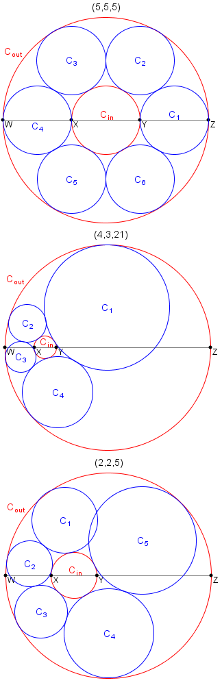

# 428 · 圆环项链

> 中文意译。英文原文见 [Project Euler Problem 428](https://projecteuler.net/problem=428)；抓取底稿见 `statement.en.md`。

设 $a$、$b$、$c$ 为正数。设 $W, X, Y, Z$ 为四个共线点，满足 $|WX| = a$、$|XY| = b$、$|YZ| = c$ 且 $|WZ| = a+b+c$。

设 $C_{in}$ 为以 $XY$ 为直径的圆，$C_{out}$ 为以 $WZ$ 为直径的圆。

若能放置 $k \geq 3$ 个互不相同的圆 $C_1, C_2, \dots, C_k$ 使得下列条件成立，则称三元组 $(a,b,c)$ 为**项链三元组**：

- 对任意 $1 \leq i, j \leq k$ 且 $i \neq j$，$C_i$ 与 $C_j$ 没有公共内部点；
- 对每个 $1 \leq i \leq k$，$C_i$ 同时与 $C_{in}$ 和 $C_{out}$ 相切；
- 对每个 $1 \leq i \lt k$，$C_i$ 与 $C_{i+1}$ 相切；
- $C_k$ 与 $C_1$ 相切。

例如 $(5,5,5)$ 与 $(4,3,21)$ 是项链三元组，而可以证明 $(2,2,5)$ 不是。

设 $T(n)$ 为满足 $a$、$b$、$c$ 均为正整数且 $b \leq n$ 的项链三元组 $(a,b,c)$ 的个数。例如 $T(1) = 9$，$T(20) = 732$，$T(3000) = 438106$。

求 $T(1\,000\,000\,000)$。
