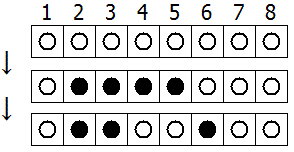

# 430 · 区间翻转

> 中文意译。英文原文见 [Project Euler Problem 430](https://projecteuler.net/problem=430)；抓取底稿见 `statement.en.md`。

$N$ 个圆盘排成一排，从左到右编号为 $1$ 到 $N$。

每个圆盘有一面黑、一面白。初始时所有圆盘都朝上白面。

每一回合中，均匀随机地选出 $1$ 到 $N$ 之间（可以相等的）两个整数 $A$ 与 $B$。

所有编号从 $A$ 到 $B$（含端点）的圆盘被翻转。

下面的例子展示 $N = 8$ 的情形：第一回合 $A = 5$、$B = 2$，第二回合 $A = 4$、$B = 6$。

设 $E(N,M)$ 为 $M$ 回合后朝上白面的圆盘数的期望。

可以验证 $E(3,1) = 10/9$，$E(3,2) = 5/3$，$E(10,4) \approx 5.157$，$E(100,10) \approx 51.893$。

求 $E(10^{10}, 4000)$，答案保留小数点后 $2$ 位。
