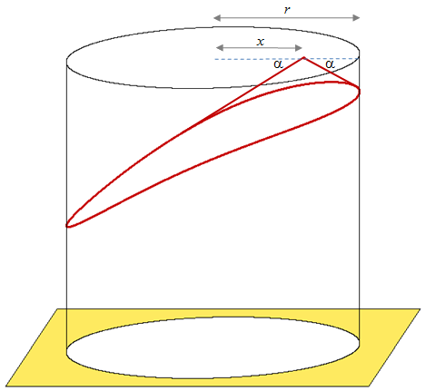

# 431 · 方形空间筒仓

> 中文意译。英文原文见 [Project Euler Problem 431](https://projecteuler.net/problem=431)；抓取底稿见 `statement.en.md`。

农夫 Fred 安排在他的农场里安装一座新的储粮筒仓。由于他对一切方形的事物都极度痴迷，当他发现这座筒仓是圆形的时候，他彻底崩溃了。

安装公司派来的代表 Quentin 解释说，他们只生产圆柱形筒仓，但他指出：这座筒仓坐落在一个方形的底座上。Fred 并不觉得这有什么好笑，坚持要把它从自己的农场里拆走。

反应敏捷的 Quentin 解释说，当颗粒状物料从上方落下时会形成一个锥形斜面，该斜面与水平方向自然形成的夹角称为**休止角**。

例如，若休止角 $\alpha = 30$ 度，且谷物从筒仓的中心处卸入，那么在圆柱顶部会形成一个完美的圆锥。对于这座直径为 $6\mathrm m$ 的筒仓，被浪费的空间约为 $32.648388556\mathrm{m^3}$。

然而，若谷物从顶部与中心水平距离为 $x$ 米的某一点卸入，则会形成一个底面弯曲、倾斜得很奇怪的锥体。他给 Fred 看了一张图。

我们用 $V(x)$ 表示被浪费空间的立方米数。若 $x = 1.114785284$（它的小数位恰好是 $9$ 位，即 $3$ 的平方），则被浪费的空间 $V(1.114785284) \approx 36$。在本题可能的解范围内，恰好还有一个解：$V(2.511167869) \approx 49$。这就像知道那个正方形是筒仓之王，无比荣耀地端坐在你的谷物之上。

面对这个优雅的解决方案，Fred 的眼睛因喜悦而发亮；但仔细检查了 Quentin 的图纸与计算之后，他的快乐又一次变成了沮丧。Fred 向 Quentin 指出：筒仓的**半径**是 $6$ 米，而不是直径；他谷物的休止角是 $40$ 度。不过，如果 Quentin 能为这座特定的筒仓找出一组解，他就很乐意把它留下来。

若反应敏捷的 Quentin 想要满足这位挑剔得令人抓狂的农夫 Fred 对一切方形事物的胃口，就请确定所有能使被浪费的空间恰为完全平方数的方案所对应的 $x$ 值，并计算 $\sum x$，精确到小数点后 $9$ 位。
