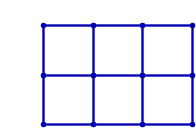
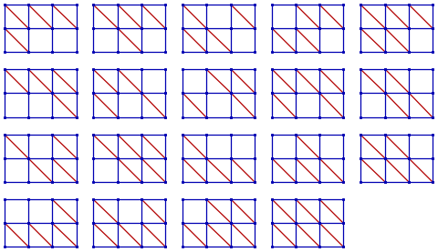

# 434 · 刚性图

> 中文意译。英文原文见 [Project Euler Problem 434](https://projecteuler.net/problem=434)；抓取底稿见 `statement.en.md`。

回顾：图是顶点以及连接顶点的边的集合；由一条边相连的两个顶点称为相邻的。

把每个顶点与欧几里得空间中的一个点对应起来，就可以把图嵌入欧几里得空间。

**柔性图**是图的一种嵌入：可以连续移动一个或多个顶点，使至少有一对不相邻顶点之间的距离发生改变，同时保持每一对相邻顶点之间的距离不变。

**刚性图**是图的不是柔性的嵌入。

通俗地说，如果把顶点换成可自由旋转的铰链、把边换成不可弯曲且无弹性的杆，图仍没有任何部分能够相对其余部分独立移动，那么这个图就是刚性的。

嵌入欧几里得平面的网格图不是刚性的，如下面的动画所示：

不过，给格子加上对角边就能使它们变得刚性。例如，对于 $2\times 3$ 网格图，有 $19$ 种使它变得刚性的方式：

注意：就本题而言，改变某条对角边的方向、或给一个格子同时加上两条对角边，都不算作不同的使网格图变刚性的方式。

设 $R(m,n)$ 为使 $m \times n$ 网格图变刚性的方式数。例如 $R(2,3) = 19$，$R(5,5) = 23679901$。

定义 $S(N) = \sum R(i,j)$，其中 $1 \leq i, j \leq N$。例如 $S(5) = 25021721$。

求 $S(100)$，答案对 $1000000033$ 取模。
