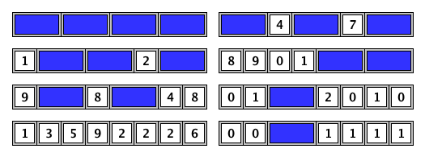

# 440 · 最大公约数与铺砖

> 中文意译。英文原文见 [Project Euler Problem 440](https://projecteuler.net/problem=440)；抓取底稿见 `statement.en.md`。

我们想用 $1 \times 2$ 的砖块、或顶面写有一位十进制数字的 $1 \times 1$ 砖块，把一块长为 $n$、高为 $1$ 的板完全铺满：

例如，下面是长为 $n = 8$ 的板的若干种铺法：

设 $T(n)$ 为按上述方式铺满长为 $n$ 的板的铺法数。例如 $T(1) = 10$，$T(2) = 101$。

设 $S(L)$ 为三重和
$$
S(L) = \sum_{a,b,c} \gcd(T(c^a), T(c^b))
$$
其中 $1 \leq a,b,c \leq L$。

例如：

- $S(2) = 10444$
- $S(3) = 1292115238446807016106539989$
- $S(4) \bmod 987\,898\,789 = 670616280$

求 $S(2000) \bmod 987\,898\,789$。
