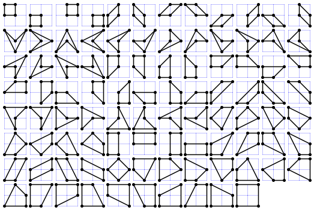

# 453 · 格点四边形

> 中文意译。英文原文见 [Project Euler Problem 453](https://projecteuler.net/problem=453)；抓取底稿见 `statement.en.md`。

简单四边形是指具有四个互不相同的顶点、没有平角且不自交的多边形。

记 $Q(m, n)$ 为顶点是坐标 $(x,y)$ 满足 $0 \le x \le m$ 且 $0 \le y \le n$ 的格点的简单四边形个数。

例如 $Q(2, 2) = 94$，如下图所示：

还可以验证 $Q(3, 7) = 39590$，$Q(12, 3) = 309000$，$Q(123, 45) = 70542215894646$。

求 $Q(12345, 6789) \bmod 135707531$。
