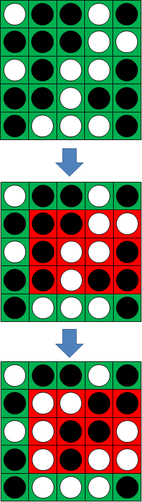

# 459 · 翻硬币游戏

> 中文意译。英文原文见 [Project Euler Problem 459](https://projecteuler.net/problem=459)；抓取底稿见 `statement.en.md`。

翻硬币游戏是在一个 $N$ 乘 $N$ 的方形棋盘上进行的双人游戏。
每个格子中放有一枚一面白、一面黑的圆片。
游戏开始时所有圆片都白色面朝上。

一次行动是指翻转某个矩形内的全部圆片，该矩形满足以下条件：

- 矩形右上角的格子中放的是白色圆片；
- 矩形宽度是完全平方数（$1$、$4$、$9$、$16$、……）；
- 矩形高度是三角形数（$1$、$3$、$6$、$10$、……）。

玩家轮流行动。把整个棋盘变为全黑的玩家获胜。

记 $W(N)$ 为在 $N$ 乘 $N$ 且所有圆片均为白色的棋盘上，假设双方都采用完美策略时先手的必胜首招数。
$W(1) = 1$，$W(2) = 0$，$W(5) = 8$，$W(10^2) = 31395$。

当 $N=5$ 时，先手的八个必胜首招如下图所示：

求 $W(10^6)$。
