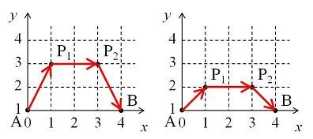

# 460 · 行进中的蚂蚁

> 中文意译。英文原文见 [Project Euler Problem 460](https://projecteuler.net/problem=460)；抓取底稿见 `statement.en.md`。

在欧几里得平面上，一只蚂蚁要从点 $A(0, 1)$ 出发前往点 $B(d, 1)$，其中 $d$ 为整数。

每一步，位于点 $(x_0, y_0)$ 的蚂蚁从满足 $x_1 \ge 0$ 且 $y_1 \ge 1$ 的格点 $(x_1, y_1)$ 中选取一个，并以恒定速度 $v$ 沿直线前往 $(x_1, y_1)$。$v$ 的取值由 $y_0$ 与 $y_1$ 决定：

- 若 $y_0 = y_1$，则 $v$ 等于 $y_0$。
- 若 $y_0 \ne y_1$，则 $v$ 等于 $(y_1 - y_0) / (\ln(y_1) - \ln(y_0))$。

左图是 $d = 4$ 时一条可能的路径。蚂蚁先从 $A(0, 1)$ 以速度 $(3 - 1) / (\ln(3) - \ln(1)) \approx 1.8205$ 前往 $P_1(1, 3)$，所需时间为 $\sqrt 5 / 1.8205 \approx 1.2283$。
再从 $P_1(1, 3)$ 以速度 $3$ 前往 $P_2(3, 3)$，所需时间为 $2 / 3 \approx 0.6667$。然后从 $P_2(3, 3)$ 以速度 $(1 - 3) / (\ln(1) - \ln(3)) \approx 1.8205$ 前往 $B(4, 1)$，所需时间为 $\sqrt 5 / 1.8205 \approx 1.2283$。
于是总时间为 $1.2283 + 0.6667 + 1.2283 = 3.1233$。

右图是另一条路径。其总时间计算为 $0.98026 + 1 + 0.98026 = 2.96052$。可以证明这是 $d = 4$ 时的最快路径。

记 $F(d)$ 为蚂蚁选择最快路径时的总用时。例如 $F(4) \approx 2.960516287$。
可以验证 $F(10) \approx 4.668187834$ 与 $F(100) \approx 9.217221972$。

求 $F(10000)$。答案保留小数点后九位。
