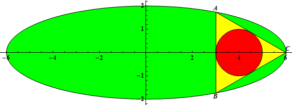
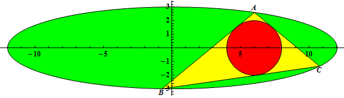

# 471 · 内接于椭圆的三角形

> 中文意译。英文原文见 [Project Euler Problem 471](https://projecteuler.net/problem=471)；抓取底稿见 `statement.en.md`。

三角形 $\triangle ABC$ 内接于方程为

$$
\frac{x^2}{a^2} + \frac{y^2}{b^2} = 1, \qquad 0 \lt 2b \lt a
$$

的椭圆上，其中 $a$ 与 $b$ 均为整数。

记 $r(a, b)$ 为当 $\triangle ABC$ 的内切圆圆心为 $(2b, 0)$、且顶点 $A$ 的坐标为 $\left( \frac{a}{2}, \frac{\sqrt{3}}{2} b \right)$ 时，该内切圆的半径。

例如 $r(3,1) = \frac{1}{2}$，$r(6,2) = 1$，$r(12,3) = 2$。

令

$$
G(n) = \sum_{a=3}^{n} \sum_{b=1}^{\left\lfloor \frac{a - 1}{2} \right\rfloor} r(a, b)
$$

已知 $G(10) = 20.59722222$，$G(100) = 19223.60980$（均四舍五入到 $10$ 位有效数字）。

求 $G(10^{11})$。

请以科学计数法作答，四舍五入到 $10$ 位有效数字，用小写字母 `e` 分隔尾数与指数。
若题目问的是 $G(10)$，答案将写作 `2.059722222e1`。
