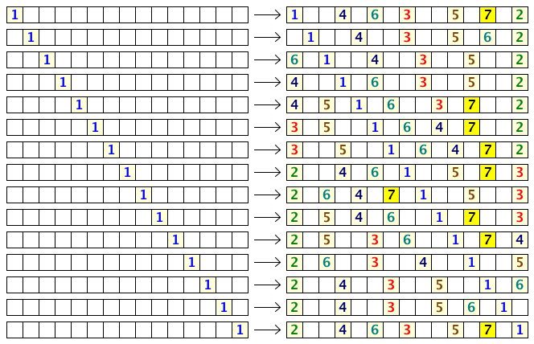

# 472 · 舒适的距离 II

> 中文意译。英文原文见 [Project Euler Problem 472](https://projecteuler.net/problem=472)；抓取底稿见 `statement.en.md`。

一排座位上共有 $N$ 个座位。$N$ 个人依次前来就座，遵守以下规则：

- 任何人不与他人相邻而坐。
- 第一个人可以任选一个座位。
- 之后每个人选择离已就座的人最远的那个座位，只要不违反规则 1；如果有多个选择满足该条件，则选最靠左的那个。

注意由于规则 1，必然有一些座位空着，因此能坐下的人数少于 $N$（当 $N \gt 1$ 时）。

下面是 $N = 15$ 时所有可能的就座安排：

可以看到，若第一个人选得恰当，这 $15$ 个座位最多能坐 $7$ 个人。
还可以看到，为使就座人数最大，第一个人有 $9$ 种选择。

记 $f(N)$ 为在 $N$ 个座位的一排座位中，第一个人为使就座人数最大而可选的座位数。于是 $f(1) = 1$，$f(15) = 9$，$f(20) = 6$，$f(500) = 16$。

另外，$1 \le N \le 20$ 时 $\sum f(N) = 83$，$1 \le N \le 500$ 时 $\sum f(N) = 13343$。

求 $1 \le N \le 10^{12}$ 时的 $\sum f(N)$。请给出答案的最后 $8$ 位数字。
