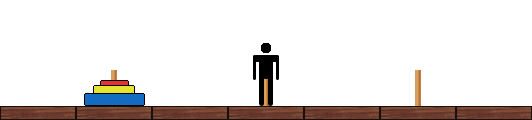

# 497 · 醉汉汉诺塔

> 中文意译。英文原文见 [Project Euler Problem 497](https://projecteuler.net/problem=497)；抓取底稿见 `statement.en.md`。

Bob 非常熟悉那个著名的数学谜题／游戏——「汉诺塔」：三根直立的柱子和若干大小不同、可以滑到任意柱子上的盘子。游戏开始时，$n$ 个盘子按大小递减摞在最左边的柱子上。游戏的目标是在下列限制下把所有盘子从最左边的柱子移到最右边的柱子：

- 每次只能移动一个盘子；
- 合法的一步移动是从某一摞的顶上取下一个盘子，放到另一摞（或空柱）上；
- 任何盘子都不能放在比它小的盘子上面。

现在来看这个游戏的一个变体：一间 $k$ 个单位宽（方砖铺成）的长房间，从左到右编号为 $1$ 到 $k$。三根柱子分别放在方格 $a$、$b$、$c$ 上，一摞 $n$ 个盘子放在方格 $a$ 的柱子上。

Bob 开始游戏时站在方格 $b$ 上。他的目标是通过把所有盘子移到方格 $c$ 的柱子上来玩汉诺塔。然而，只有当 Bob 与相应的柱子／那一摞盘子处在同一个方格时，他才能拿起或放下一个盘子。

不幸的是，Bob 还喝醉了。在每一步移动中，Bob 会以相同的概率向左踉跄一格或向右踉跄一格；但当 Bob 处在房间的两端时，他只能朝一个方向移动。尽管 Bob 醉成这副样子，他仍然能够遵守游戏本身的规则，也有权决定何时拿起或放下盘子。

下面的动画描绘了 $n = 3$，$k = 7$，$a = 2$，$b = 4$，$c = 6$ 时一局示例游戏的侧视图：

记 $E(n, k, a, b, c)$ 为一局最优对局下 Bob 走过的方格数的期望。一局游戏是最优的，当且仅当拿起盘子的次数最少。

有趣的是，结果总是一个整数。例如 $E(2,5,1,3,5) = 60$，$E(3,20,4,9,17) = 2358$。

求

$$
\sum_{1 \le n \le 10000} E(n,10^n,3^n,6^n,9^n)
$$

的最后九位。
