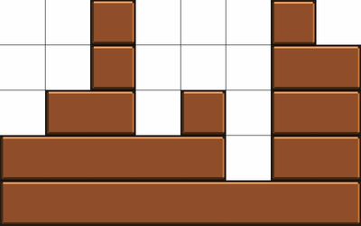

# 502 · 城堡计数

> 中文意译。英文原文见 [Project Euler Problem 502](https://projecteuler.net/problem=502)；抓取底稿见 `statement.en.md`。

我们把「积木块」定义为一个高度为 $1$、长度为整数的矩形；把若干积木块堆叠而成的构型称为一座城堡。

给定一个宽 $w$、高 $h$ 的游戏网格，城堡按如下规则生成：

- 积木块可以放在其他积木块之上，只要既不超出边缘、也不悬空在空处之上；
- 所有积木块都与网格对齐；
- 同一行中任意两块相邻的积木块之间至少留有一单位空隙；
- 最底行由一块长度为 $w$ 的积木块占据；
- 整座城堡达到的最大高度恰好为 $h$；
- 城堡由偶数块积木块搭成。

下面是 $w=8$、$h=5$ 时的一座示例城堡：

记 $F(w,h)$ 为给定网格参数 $w$ 与 $h$ 时合法城堡的数量。

例如 $F(4,2) = 10$，$F(13,10) = 3729050610636$，$F(10,13) = 37959702514$，$F(100,100) \bmod 1\,000\,000\,007 = 841913936$。

求 $(F(10^{12},100) + F(10000,10000) + F(100,10^{12})) \bmod 1\,000\,000\,007$。
