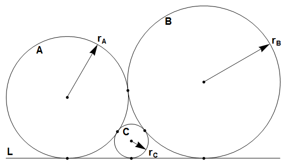

# 510 · 相切圆

> 中文意译。英文原文见 [Project Euler Problem 510](https://projecteuler.net/problem=510)；抓取底稿见 `statement.en.md`。

圆 $A$ 与圆 $B$ 互相相切，并且都与直线 $L$ 相切，三个切点各不相同。

圆 $C$ 位于 $A$、$B$ 与 $L$ 围成的区域内，并与三者都相切。

记 $r_A$、$r_B$、$r_C$ 分别为圆 $A$、$B$、$C$ 的半径。

对满足 $0 \lt r_A \le r_B \le n$ 且 $r_A$、$r_B$、$r_C$ 均为整数的三元组，令 $S(n) = \sum r_A + r_B + r_C$。

当 $0 \lt r_A \le r_B \le 5$ 时唯一的解是 $r_A = 4$、$r_B = 4$、$r_C = 1$，所以 $S(5) = 4 + 4 + 1 = 9$。另已知 $S(100) = 3072$。

求 $S(10^9)$。
