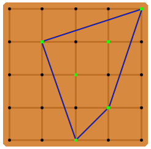

# 514 · 钉板上的形状

> 中文意译。英文原文见 [Project Euler Problem 514](https://projecteuler.net/problem=514)；抓取底稿见 `statement.en.md`。

钉板（阶数 $N$）是一块方板，板面伸出等距的钉子，构成坐标系为 $0 \le x, y \le N$ 的整数点格。

约翰从一块没有钉子的钉板开始。板上的每个位置都是一个可以插入钉子的孔。他为每个孔独立生成一个 $1$ 到 $N+1$ 之间（含两端）的随机整数；若某个孔生成的随机整数为 $1$，就在该孔中插上一枚钉子。

当约翰为全部 $(N+1)^2$ 个孔生成完数字、并插好所有相应的钉子之后，他用一根橡皮筋紧紧箍住所有伸出的钉子。设由此形成的形状为 $S$。$S$ 也可以定义为包含所有钉子的最小凸形。

上图描绘的是 $N = 4$ 的一个示例布局。绿色标记表示插了钉子的位置，蓝色线段共同表示那根橡皮筋。对这一具体布局，$S$ 的面积为 $6$。若板上的钉子少于三枚（或所有钉子共线），则可认为 $S$ 的面积为零。

记 $E(N)$ 为阶数 $N$ 的钉板上 $S$ 的期望面积。例如四舍五入到小数点后五位，$E(1) = 0.18750$，$E(2) = 0.94335$，$E(10) = 55.03013$。

求 $E(100)$，结果四舍五入到小数点后五位。
